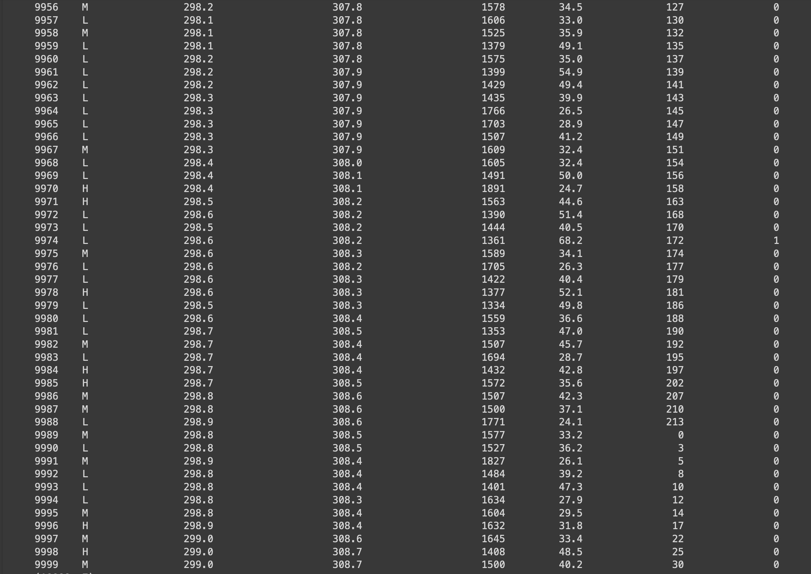
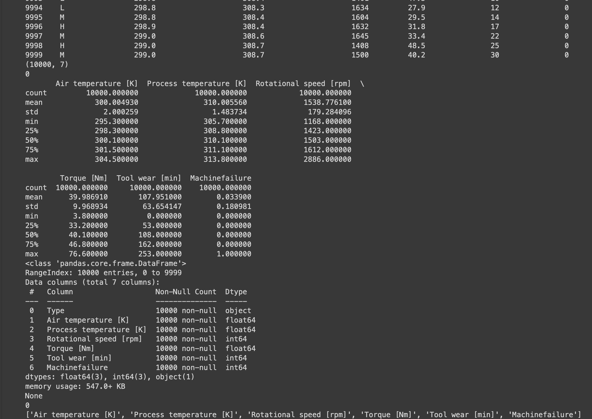
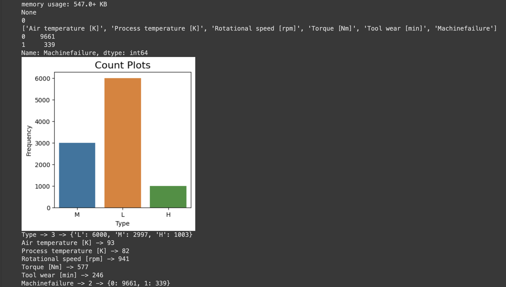
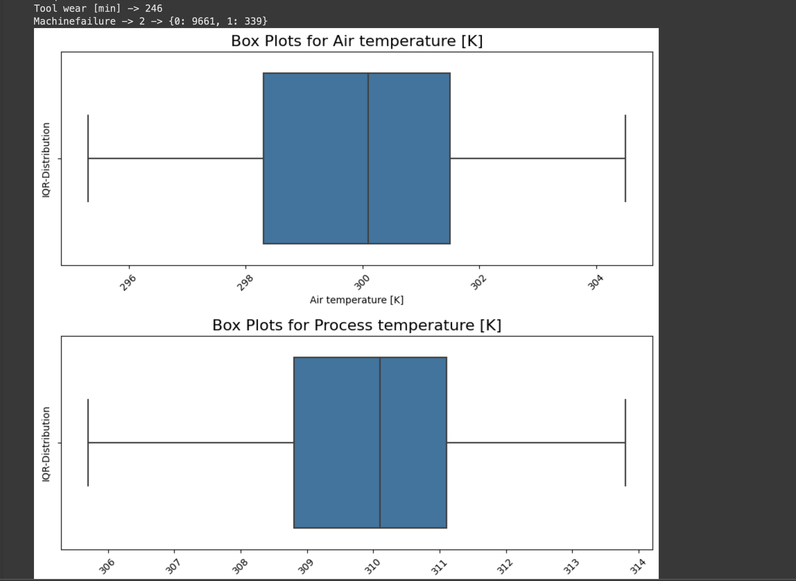
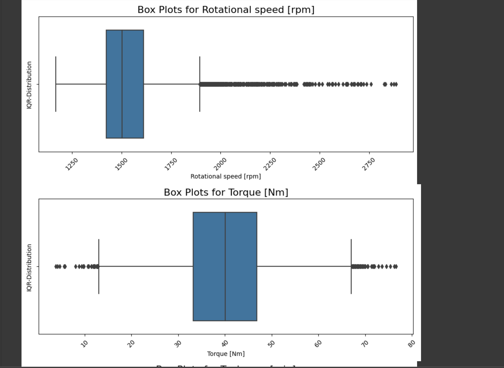
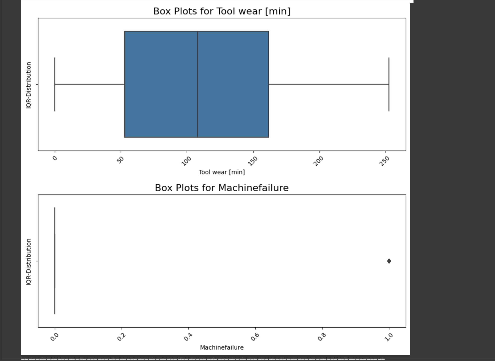
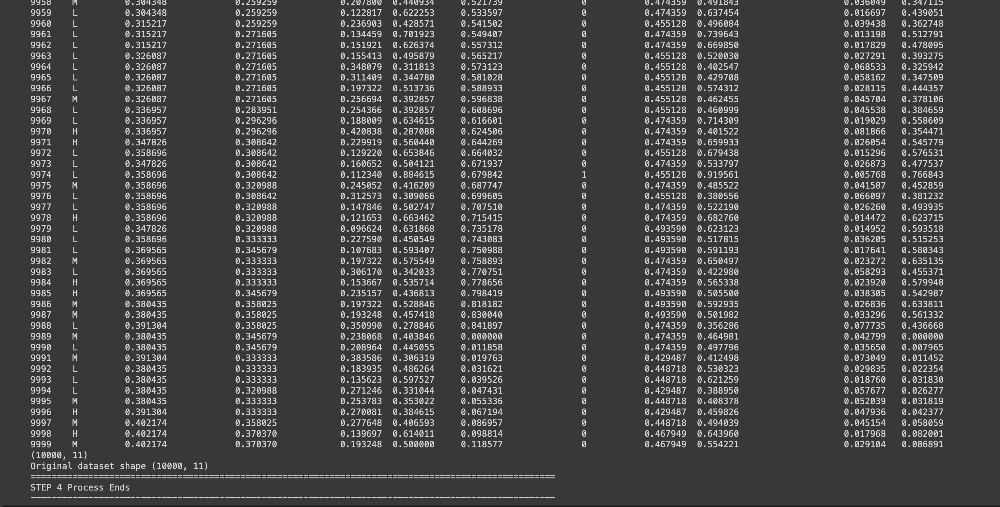
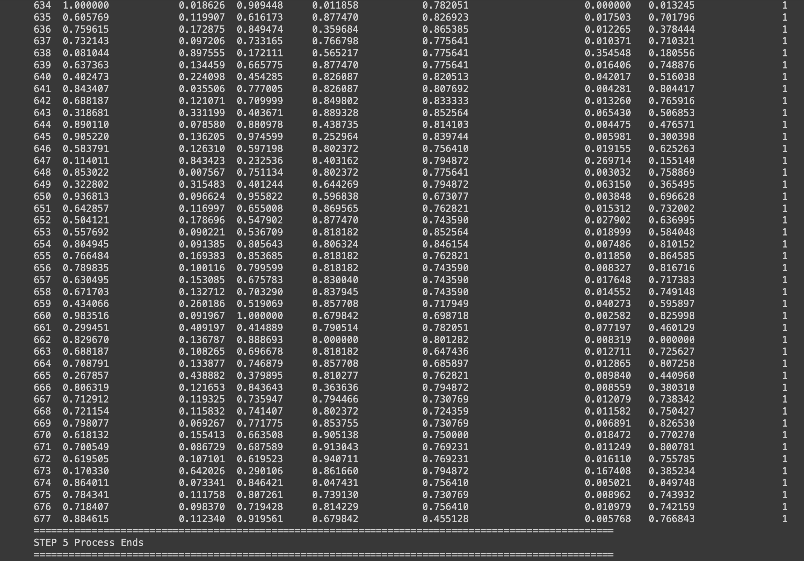
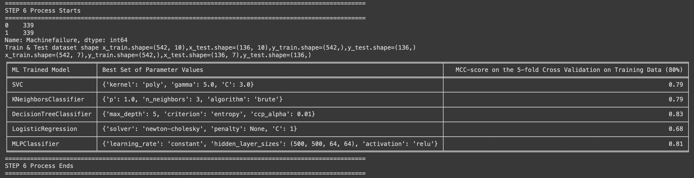
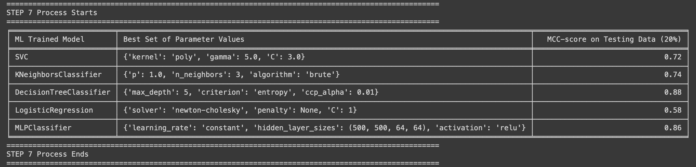

# 🎓 University Details
- **University Name:** Worcester Polytechnic Institute (WPI)
- **Location:** Worcester, MA, USA
- **Duration:** Aug 2023 - Present

## 📘 Course Details
- **Program:** M.S. Data Science

## 🧠 Coursework
- **Core Topics:**
  - Deep Learning
  - Artificial Intelligence
  - Information Retrieval
  - Knowledge Discovery & Data Mining
  - Business Intelligence
  - Natural Language Processing
  - Statistics

### 📚 Courses Taken in Fall 2023
- **Deep Learning**
- **Artificial Intelligence**
- **Information Retrieval**
- **Knowledge Discovery & Data Mining**

### 📅 Courses Taken in Spring 2024
- **Business Intelligence**
- **Natural Language Processing**
- **Statistics**

### 🗂️ Repository Structure
A structured overview of the repository's contents to guide you through the code, documentation, and analysis.

- **Fall_2023**/
  - **CS_534_AI**/
    - **assignments**/
      - **1**/
        - [Sheroz_AI_534_Homework_Assignment_1.pdf](Fall_2023/CS_534_AI/assignments/1/Sheroz_AI_534_Homework_Assignment_1.pdf)
        - [Sheroz_AI_534_Homework_Assignment_1.py](Fall_2023/CS_534_AI/assignments/1/Sheroz_AI_534_Homework_Assignment_1.py)
      - **2**/
        - [RomaniaCityApp.py](Fall_2023/CS_534_AI/assignments/2/RomaniaCityApp.py)
        - [SimpleProblemSolvingAgent.py](Fall_2023/CS_534_AI/assignments/2/SimpleProblemSolvingAgent.py)
      - **3**/
        - [TicTacToeClass.py](Fall_2023/CS_534_AI/assignments/3/TicTacToeClass.py)
        - [TicTacToeGameApp.py](Fall_2023/CS_534_AI/assignments/3/TicTacToeGameApp.py)
      - **4**/
        - **Sheroz_AI_534_Homework_Assignment_P1**/
          - 
          - 
          - 
          - 
          - 
          - 
          - 
          - 
          - 
          - 
          - [MachineFailurePredictorPipeline.py](Fall_2023/CS_534_AI/assignments/4/Sheroz_AI_534_Homework_Assignment_P1/MachineFailurePredictorPipeline.py)
          - [ai4i2020.csv](Fall_2023/CS_534_AI/assignments/4/Sheroz_AI_534_Homework_Assignment_P1/ai4i2020.csv)
          - [pb1_x_test.npy](Fall_2023/CS_534_AI/assignments/4/Sheroz_AI_534_Homework_Assignment_P1/pb1_x_test.npy)
          - [pb1_x_train.npy](Fall_2023/CS_534_AI/assignments/4/Sheroz_AI_534_Homework_Assignment_P1/pb1_x_train.npy)
          - [pb1_y_test.npy](Fall_2023/CS_534_AI/assignments/4/Sheroz_AI_534_Homework_Assignment_P1/pb1_y_test.npy)
          - [pb1_y_train.npy](Fall_2023/CS_534_AI/assignments/4/Sheroz_AI_534_Homework_Assignment_P1/pb1_y_train.npy)
        - **Sheroz_AI_534_Homework_Assignment_P2**/
          - [AlexNetPredictorPipeline.py](Fall_2023/CS_534_AI/assignments/4/Sheroz_AI_534_Homework_Assignment_P2/AlexNetPredictorPipeline.py)
          - 
          - 
          - [complete_mednode_dataset](Fall_2023/CS_534_AI/assignments/4/Sheroz_AI_534_Homework_Assignment_P2/complete_mednode_dataset)
          - [melanoma.zip](Fall_2023/CS_534_AI/assignments/4/Sheroz_AI_534_Homework_Assignment_P2/melanoma.zip)
          - [naevus.zip](Fall_2023/CS_534_AI/assignments/4/Sheroz_AI_534_Homework_Assignment_P2/naevus.zip)
          - [testset.zip](Fall_2023/CS_534_AI/assignments/4/Sheroz_AI_534_Homework_Assignment_P2/testset.zip)
          - [trainset.zip](Fall_2023/CS_534_AI/assignments/4/Sheroz_AI_534_Homework_Assignment_P2/trainset.zip)
  - **CS_541_DL**/
    - **assignments**/
      - **1**/
        - [HomeWork_1_Solution.pdf](Fall_2023/CS_541_DL/assignments/1/HomeWork_1_Solution.pdf)
        - [Sheroz_DL_541_Homework_Assignment_1.pdf](Fall_2023/CS_541_DL/assignments/1/Sheroz_DL_541_Homework_Assignment_1.pdf)
      - **2**/
        - [HomeWork_2_Solution.pdf](Fall_2023/CS_541_DL/assignments/2/HomeWork_2_Solution.pdf)
        - [Sheroz_DL_541_Homework_Assignment_2.pdf](Fall_2023/CS_541_DL/assignments/2/Sheroz_DL_541_Homework_Assignment_2.pdf)
      - **3**/
        - [HomeWork_3_Solution.pdf](Fall_2023/CS_541_DL/assignments/3/HomeWork_3_Solution.pdf)
        - [Sheroz_DL_541_Homework_Assignment_3.pdf](Fall_2023/CS_541_DL/assignments/3/Sheroz_DL_541_Homework_Assignment_3.pdf)
      - **4**/
        - [HomeWork_4_Solution.zip](Fall_2023/CS_541_DL/assignments/4/HomeWork_4_Solution.zip)
        - [Sheroz_DL_541_Homework_Assignment_4.pdf](Fall_2023/CS_541_DL/assignments/4/Sheroz_DL_541_Homework_Assignment_4.pdf)
        - [Sheroz_DL_541_Homework_Assignment_4.py](Fall_2023/CS_541_DL/assignments/4/Sheroz_DL_541_Homework_Assignment_4.py)
      - **5**/
        - [Sheroz_DL_541_Homework_Assignment_5.pdf](Fall_2023/CS_541_DL/assignments/5/Sheroz_DL_541_Homework_Assignment_5.pdf)
        - [Sheroz_DL_541_Homework_Assignment_5.py](Fall_2023/CS_541_DL/assignments/5/Sheroz_DL_541_Homework_Assignment_5.py)
      - **6**/
        - [HomeWork_6_Solution.zip](Fall_2023/CS_541_DL/assignments/6/HomeWork_6_Solution.zip)
        - [Sheroz_DL_541_Homework_Assignment_6.pdf](Fall_2023/CS_541_DL/assignments/6/Sheroz_DL_541_Homework_Assignment_6.pdf)
        - [Sheroz_DL_541_Homework_Assignment_6.py](Fall_2023/CS_541_DL/assignments/6/Sheroz_DL_541_Homework_Assignment_6.py)
    - **reading**/
      - [1.txt](Fall_2023/CS_541_DL/reading/1.txt)
      - [2.txt](Fall_2023/CS_541_DL/reading/2.txt)
      - [3.txt](Fall_2023/CS_541_DL/reading/3.txt)
      - [4.txt](Fall_2023/CS_541_DL/reading/4.txt)
  - **CS_547_IR**/
    - **assignments**/
      - **1**/
        - [Sheroz_IR_547_Homework_Assignment_1.py](Fall_2023/CS_547_IR/assignments/1/Sheroz_IR_547_Homework_Assignment_1.py)
      - **2**/
        - [Sheroz_IR_547_Homework_Assignment_2.pdf](Fall_2023/CS_547_IR/assignments/2/Sheroz_IR_547_Homework_Assignment_2.pdf)
        - [Sheroz_IR_547_Homework_Assignment_2.py](Fall_2023/CS_547_IR/assignments/2/Sheroz_IR_547_Homework_Assignment_2.py)
      - **3**/
        - [Sheroz_IR_547_Homework_Assignment_3.py](Fall_2023/CS_547_IR/assignments/3/Sheroz_IR_547_Homework_Assignment_3.py)
      - **4**/
        - [Sheroz_IR_547_Homework_Assignment_4.ipynb](Fall_2023/CS_547_IR/assignments/4/Sheroz_IR_547_Homework_Assignment_4.ipynb)
  - **CS_548_KDDM**/
    - **assignments**/
      - **1**/
        - [Sheroz_KDDM_548_Homework_Assignment_1.ipynb](Fall_2023/CS_548_KDDM/assignments/1/Sheroz_KDDM_548_Homework_Assignment_1.ipynb)
        - [Sheroz_KDDM_548_Homework_Assignment_1.pdf](Fall_2023/CS_548_KDDM/assignments/1/Sheroz_KDDM_548_Homework_Assignment_1.pdf)
- **Spring_2024**/
  - **DS_502_STATS**/
    - **assignments**/
      - **1**/
        - [Sheroz_STATS_502_Homework_Assignment_1.R](Spring_2024/DS_502_STATS/assignments/1/Sheroz_STATS_502_Homework_Assignment_1.R)
        - [Sheroz_STATS_502_Homework_Assignment_1.pdf](Spring_2024/DS_502_STATS/assignments/1/Sheroz_STATS_502_Homework_Assignment_1.pdf)
      - **2**/
        - [Sheroz_STATS_502_Homework_Assignment_2.R](Spring_2024/DS_502_STATS/assignments/2/Sheroz_STATS_502_Homework_Assignment_2.R)
        - [Sheroz_STATS_502_Homework_Assignment_2.pdf](Spring_2024/DS_502_STATS/assignments/2/Sheroz_STATS_502_Homework_Assignment_2.pdf)
      - **3**/
        - [Sheroz_STATS_502_Homework_Assignment_3.R](Spring_2024/DS_502_STATS/assignments/3/Sheroz_STATS_502_Homework_Assignment_3.R)
        - [Sheroz_STATS_502_Homework_Assignment_3.pdf](Spring_2024/DS_502_STATS/assignments/3/Sheroz_STATS_502_Homework_Assignment_3.pdf)
      - **4**/
        - [Sheroz_STATS_502_Homework_Assignment_4.ipynb](Spring_2024/DS_502_STATS/assignments/4/Sheroz_STATS_502_Homework_Assignment_4.ipynb)
        - [Sheroz_STATS_502_Homework_Assignment_4.pdf](Spring_2024/DS_502_STATS/assignments/4/Sheroz_STATS_502_Homework_Assignment_4.pdf)
  - **DS_595_NLP**/
    - **assignments**/
      - **1**/
        - [Detection_of_Online_Fake_News_Using_N-Gram_Analysis_and_Machine_Learning_Techniques.pdf](Spring_2024/DS_595_NLP/assignments/1/Detection_of_Online_Fake_News_Using_N-Gram_Analysis_and_Machine_Learning_Techniques.pdf)
        - [Sheroz_NLP_595_Homework_Assignment_1.ipynb](Spring_2024/DS_595_NLP/assignments/1/Sheroz_NLP_595_Homework_Assignment_1.ipynb)
        - [Sheroz_NLP_595_Homework_Assignment_1.pdf](Spring_2024/DS_595_NLP/assignments/1/Sheroz_NLP_595_Homework_Assignment_1.pdf)
        - [Supervised_Learning_for_Fake_News_Detection.pdf](Spring_2024/DS_595_NLP/assignments/1/Supervised_Learning_for_Fake_News_Detection.pdf)
      - **2**/
        - [Sheroz_NLP_595_Homework_Assignment_2.ipynb](Spring_2024/DS_595_NLP/assignments/2/Sheroz_NLP_595_Homework_Assignment_2.ipynb)
        - [Sheroz_NLP_595_Homework_Assignment_2.pdf](Spring_2024/DS_595_NLP/assignments/2/Sheroz_NLP_595_Homework_Assignment_2.pdf)
        - [Sheroz_NLP_595_Homework_Assignment_2_Summary.csv](Spring_2024/DS_595_NLP/assignments/2/Sheroz_NLP_595_Homework_Assignment_2_Summary.csv)
  - **MIS_584_BI**/
    - **assignments**/
      - **1**/
        - [Customers_Cleaned.csv](Spring_2024/MIS_584_BI/assignments/1/Customers_Cleaned.csv)
        - [Customers_Cleaned.xlsx](Spring_2024/MIS_584_BI/assignments/1/Customers_Cleaned.xlsx)
        - [Sheroz_MIS_584_Homework_Assignment_1.docx](Spring_2024/MIS_584_BI/assignments/1/Sheroz_MIS_584_Homework_Assignment_1.docx)
        - [Sheroz_MIS_584_Homework_Assignment_1.tflx](Spring_2024/MIS_584_BI/assignments/1/Sheroz_MIS_584_Homework_Assignment_1.tflx)
      - **2**/
        - [Dataset_Vending Machines.xlsx](Spring_2024/MIS_584_BI/assignments/2/Dataset_Vending%20Machines.xlsx)
        - [Sheroz_MIS_584_Homework_Assignment_2.pdf](Spring_2024/MIS_584_BI/assignments/2/Sheroz_MIS_584_Homework_Assignment_2.pdf)
      - **3**/
        - [Sheroz_MIS_584_Homework_Assignment_3.pdf](Spring_2024/MIS_584_BI/assignments/3/Sheroz_MIS_584_Homework_Assignment_3.pdf)
        - [Sheroz_MIS_584_Homework_Assignment_3.twbx](Spring_2024/MIS_584_BI/assignments/3/Sheroz_MIS_584_Homework_Assignment_3.twbx)
        - [Video Games_Sales (2013-2018).xlsx](Spring_2024/MIS_584_BI/assignments/3/Video%20Games_Sales%20(2013-2018).xlsx)
      - **4**/
        - [Sheroz_MIS_584_Homework_Assignment_4.pdf](Spring_2024/MIS_584_BI/assignments/4/Sheroz_MIS_584_Homework_Assignment_4.pdf)
        - [Sheroz_MIS_584_Homework_Assignment_4.twbx](Spring_2024/MIS_584_BI/assignments/4/Sheroz_MIS_584_Homework_Assignment_4.twbx)
      - **5**/
        - [Sheroz_MIS_584_Homework_Assignment_5.pdf](Spring_2024/MIS_584_BI/assignments/5/Sheroz_MIS_584_Homework_Assignment_5.pdf)
        - [Sheroz_MIS_584_Homework_Assignment_5.twbx](Spring_2024/MIS_584_BI/assignments/5/Sheroz_MIS_584_Homework_Assignment_5.twbx)
      - **6**/
        - [Dataset_HR Performance.xlsx](Spring_2024/MIS_584_BI/assignments/6/Dataset_HR%20Performance.xlsx)
        - [Sheroz_MIS_584_Homework_Assignment_6.pdf](Spring_2024/MIS_584_BI/assignments/6/Sheroz_MIS_584_Homework_Assignment_6.pdf)
        - [Sheroz_MIS_584_Homework_Assignment_6.twbx](Spring_2024/MIS_584_BI/assignments/6/Sheroz_MIS_584_Homework_Assignment_6.twbx)
      - **7**/
        - [Sheroz_MIS_584_Homework_Assignment_7.pdf](Spring_2024/MIS_584_BI/assignments/7/Sheroz_MIS_584_Homework_Assignment_7.pdf)
        - [Sheroz_MIS_584_Homework_Assignment_7.twbx](Spring_2024/MIS_584_BI/assignments/7/Sheroz_MIS_584_Homework_Assignment_7.twbx)
        - [Wholesale customers.xlsx](Spring_2024/MIS_584_BI/assignments/7/Wholesale%20customers.xlsx)
      - **8**/
        - [Sheroz_MIS_584_Homework_Assignment_8.pdf](Spring_2024/MIS_584_BI/assignments/8/Sheroz_MIS_584_Homework_Assignment_8.pdf)
        - [Sheroz_MIS_584_Homework_Assignment_8.xlsx](Spring_2024/MIS_584_BI/assignments/8/Sheroz_MIS_584_Homework_Assignment_8.xlsx)
      - **9**/
        - [Sheroz_MIS_584_Homework_Assignment_9.pdf](Spring_2024/MIS_584_BI/assignments/9/Sheroz_MIS_584_Homework_Assignment_9.pdf)
        - [Sheroz_MIS_584_Homework_Assignment_9.twbx](Spring_2024/MIS_584_BI/assignments/9/Sheroz_MIS_584_Homework_Assignment_9.twbx)
        - [Sheroz_MIS_584_Homework_Assignment_9_R&D.twbx](Spring_2024/MIS_584_BI/assignments/9/Sheroz_MIS_584_Homework_Assignment_9_R&D.twbx)
